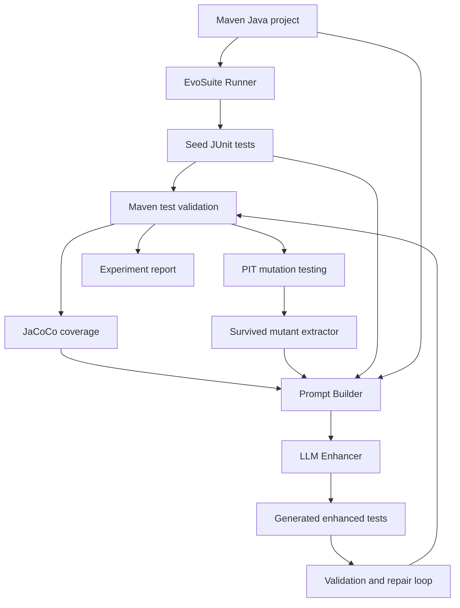

# 设计说明

## 研究问题

EvoSuite 擅长生成高覆盖率测试，但生成的断言常偏回归式，测试名和可读性也较弱。LLM 能根据源码语义补充更自然的 oracle，但直接从零生成 Java 单元测试容易出现编译错误、依赖幻觉和不稳定测试。

本项目采用混合式路线：让 EvoSuite 负责生成可运行 seed suite，再让 LLM 在 PIT mutation feedback 的约束下增强测试。

## 架构



## 模块映射

| 模块 | 文件 | 作用 |
| --- | --- | --- |
| EvoSuite Runner | `mglet/evosuite.py` | 调用 EvoSuite jar，生成 seed tests 并导出 |
| Maven Project Helper | `mglet/java_project.py` | 定位源码、测试文件、构造 classpath、运行 Maven goal |
| PIT Parser | `mglet/pitest.py` | 解析 `mutations.xml`，提取 survived / no coverage mutants |
| JaCoCo Parser | `mglet/coverage.py` | 解析 `jacoco.xml` 的 LINE / BRANCH 等 counter |
| Prompt Builder | `mglet/prompting.py` | 组织源码、测试、覆盖率、变异体反馈 |
| LLM Client | `mglet/llm.py` | OpenAI-compatible API、文件响应、dry-run 模式 |
| Patch Writer | `mglet/patching.py` | 从 LLM 响应提取 Java 文件并安全写入项目 |
| Evaluator | `mglet/evaluator.py` | 运行 test / JaCoCo / PIT 并汇总指标 |
| Pipeline | `mglet/pipeline.py` | 串联生成、增强、修复、评估 |
| Reporter | `mglet/reports.py` | 输出 JSON 和 Markdown 实验摘要 |

## 创新点实现

### 变异算子类型感知的 Prompt

`mglet/pitest.py` 会对 PIT survived mutants 做分类：

- `ConditionalsBoundaryMutator` -> `boundary-condition`
- `NegateConditionalsMutator` -> `branch-polarity`
- `MathMutator` -> `numeric-formula`
- return mutators -> `return-oracle`

`mglet/prompting.py` 会把这些分类转成具体提示策略。例如边界变异要求生成阈值上下界测试，数学变异要求断言精确金额，返回值变异要求直接断言布尔值、字符串和结果字段。

### 业务规则增强的 Test Oracle

`mglet/pipeline.py` 在每轮增强前会调用 `build_rule_extraction_messages`，让 LLM 先从相关 Java 源码中抽取业务规则。若 dry-run 或模型没有返回规则，`mglet/prompting.py` 仍会使用启发式规则提取作为兜底。

这些业务规则会进入增强 prompt，要求 LLM 生成语义断言，而不是只复制 EvoSuite 的回归式断言。

### Assertion Strength Score

`mglet/static_metrics.py` 会计算断言强度：

- 精确值断言、`assertThat`、金额断言得分更高。
- `assertNotNull` / `assertNull` 这类弱 oracle 得分较低。
- 对 `CheckoutResult` 字段、`rejectionReason`、`discountFor` 等业务结果的断言会获得语义加分。

`mglet/reports.py` 会把该分数输出到 `summary.md` 的 `Assert Strength` 列。

## 为什么用 PIT 反馈

Coverage 只能说明代码是否被执行，不能说明断言是否能发现错误。PIT 通过修改程序行为生成 mutants，如果测试能失败就说明该 mutant 被 killed。EvoSuite 原始测试可能覆盖了分支，但断言不足时 mutation score 仍然低，因此 mutation score 更适合作为本项目的主指标。

## LLM 输出约束

LLM 必须返回完整 Java 文件，并在代码块开头提供相对路径：

```java
// path: src/test/java/edu/course/demo/DiscountCalculatorLLMEnhancedTest.java
package edu.course.demo;

public class DiscountCalculatorLLMEnhancedTest {
}
```

`mglet/patching.py` 会拒绝写出项目目录外的路径，避免模型返回危险路径。
